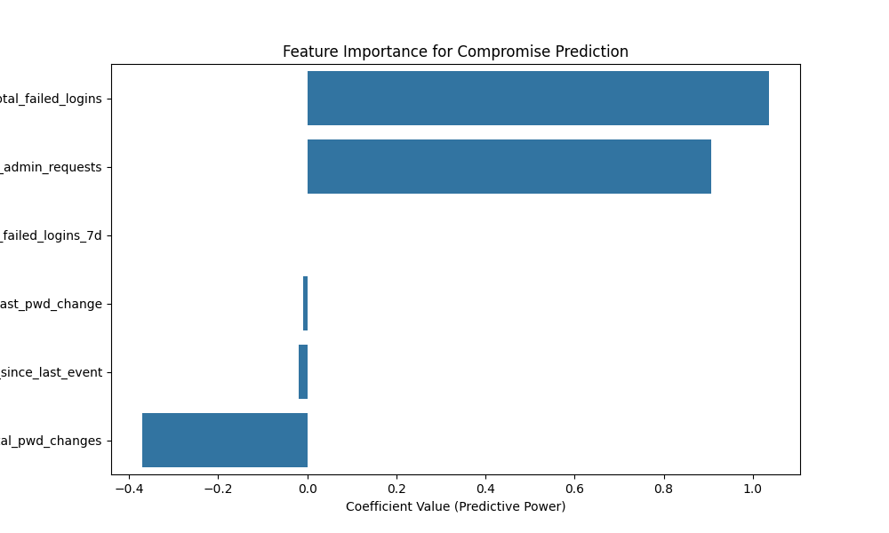
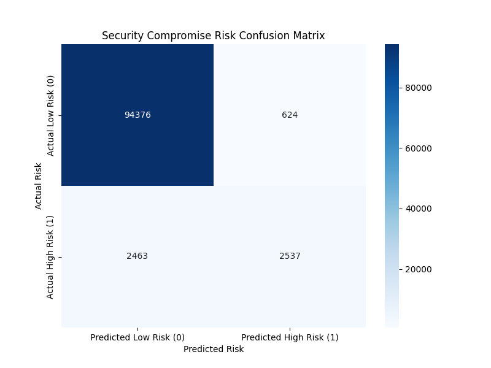
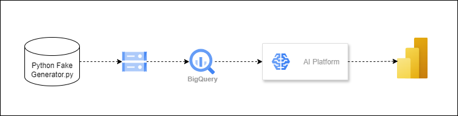
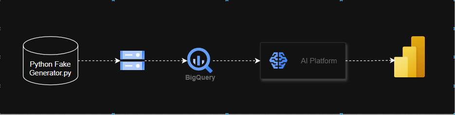

# <h1> Predictive_Modeling_"Active_Directory_Compromise_Risk"</h1>
# 
This project simulates a security data analyst role, where you use systems data to build a simple risk-scoring model. The complexity lies in the data preparation and advanced SQL aggregation.

<!doctype html>
<html lang="en">
<head>
  <meta charset="utf-8" />
  <meta name="viewport" content="width=device-width,initial-scale=1" />
  <title>Predictive_Modeling_-Active_Directory_Compromise_Risk</title>
  
</head>
<body>
  <header>
    <h1>Predictive_Modeling_-Active_Directory_Compromise_Risk</h1>
    
This repository contains code, sample data, SQL feature queries and a notebook used to build a simple risk-scoring model that estimates Active Directory compromise risk from authentication logs.

    <nav>
      <a href="#data">Data</a> · <a href="#notebook">Notebook</a> · <a href="#images">Images</a> · <a href="#run">Run (Windows)</a> · <a href="#files">Important files</a>
    </nav>
  </header>

  <section id="data">
    <h2>Data and artifacts</h2>
    <ul>
      <li>Raw <code>raw_security_logs.csv</code> — example raw logs</li>
      <li>Targets <code>user_target.csv</code> — target labels / enriched labels</li>
      <li>Scripts <code>Data_Generator.py</code> — synthetic or pre-processing script</li>
      <li>SQL <code>Feature_query.sql</code> — SQL used for feature aggregation</li>
      <li>Notebook <code>dapersonalproject.t (Oct 30, 2025, 9_24_51 AM).ipynb</code> — analysis, feature engineering and modeling</li>
    </ul>
  </section>

  <section id="notebook">
    <h2>Notebook</h2>
    
Open the main analysis notebook on GitHub or locally via Jupyter. Click the file name below to open on GitHub:

    <ul>
      <li>
        <a href="dapersonalproject.t%20(Oct%2030%2C%202025%2C%209_24_51%20AM).ipynb">dapersonalproject.t (Oct 30, 2025, 9_24_51 AM).ipynb</a>
      </li>
    </ul>
    
The notebook demonstrates data loading from <code>raw_security_logs.csv</code>, feature aggregation using <code>Feature_query.sql</code>, feature engineering with <code>Data_Generator.py</code>, and modeling/evaluation.

  </section>

  <section id="images">
    <h2>Images / Visuals</h2>
    

      

        <strong>Feature importance</strong>
        
        
<code>images/feature_importance.png</code>

      

      

        <strong>Confusion matrix</strong>
        
        
<code>images/confusion_matrix.png</code>

      

      

        <strong>Security analysis</strong>
        
        
<code>images/security_analysis.png</code>

      

      

        <strong>Dataflow / pipeline</strong>
        
        
<code>images/Dataflow.gif</code>

      

    

  </section>

  <section id="run">
    <h2>How to run locally (Windows)</h2>
    
Short steps to reproduce locally:

    <pre><code>git clone &lt;repo-url&gt;
cd Predictive_Modeling_-Active_Directory_Compromise_Risk

python -m venv .venv
.venv\Scripts\activate

pip install -r requirements.txt  # if present

jupyter lab    # or jupyter notebook
</code></pre>
    
Open the notebook listed above and run cells in order: data prep &rarr; feature extraction &rarr; modeling &rarr; evaluation.

  </section>

  <section id="files">
    <h2>Important files</h2>
    <ul>
      <li><code>dapersonalproject.t (Oct 30, 2025, 9_24_51 AM).ipynb</code> — analysis notebook</li>
      <li><code>Data_Generator.py</code> — data generation / preprocessing</li>
      <li><code>Feature_query.sql</code> — SQL feature queries</li>
      <li><code>raw_security_logs.csv</code>, <code>user_target.csv</code> — raw and label data</li>
      <li><code>images/</code> — visuals used in the notebook</li>
      <li><code>LICENSE</code> — repository license</li>
    </ul>
  </section>

  <footer>
    
Repository owner: <code>Yaswanthv5</code>

    
Save this document as <code>README.md</code> (or <code>README.html</code>) at repository root to provide clickable links to notebooks and images on GitHub.

  </footer>
</body>
</html>